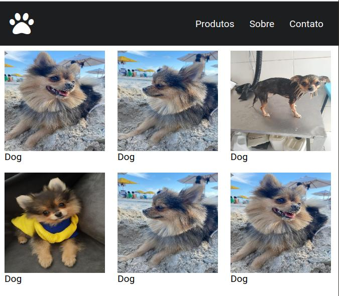

# 🎨 HTML/CSS Design - Flex layout with side by side wrap images

The idea is to create a design to explore flex feature from CSS. It is based on the design developed and implemented by Origamid on [Youtube channel](https://www.youtube.com/watch?v=x-4z_u8LcGc)

# 🚀 Live

Check the live design [HERE](https://storage.googleapis.com/rfribeiro-css/flex-01-design/index.html)